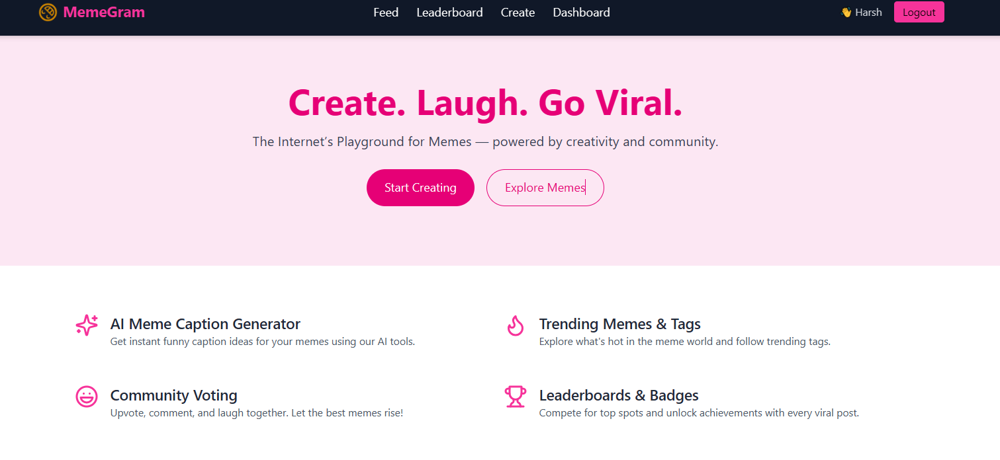
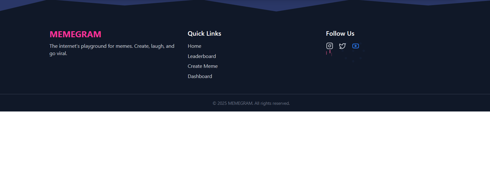
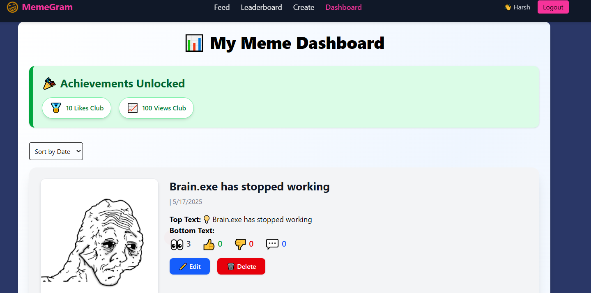
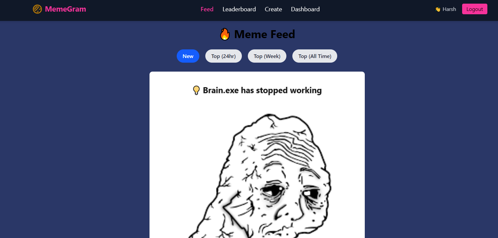
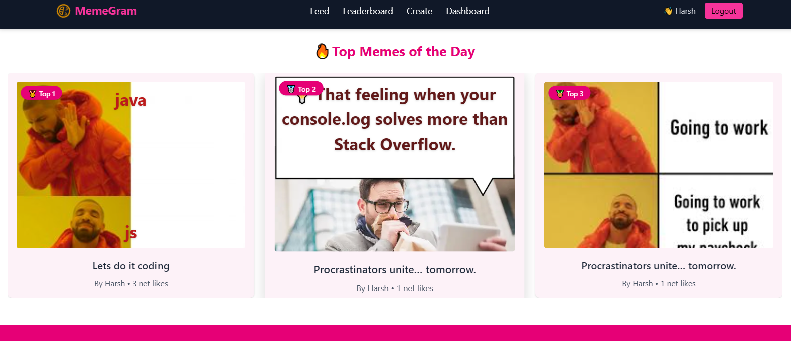
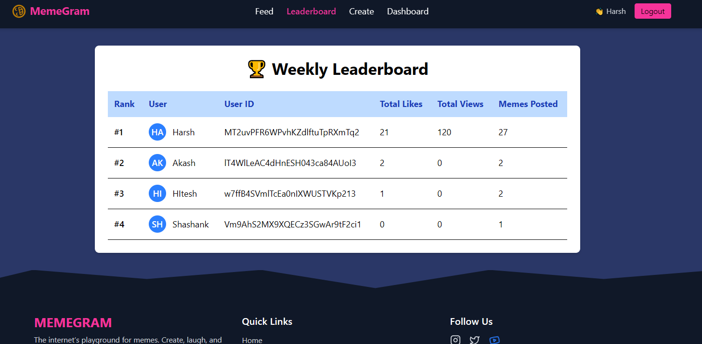

# 🎭 MemeGram - The Internet’s Playground for Memes

## 🌐 Live Demo Link
https://memegram-neon.vercel.app/
## For Testing purpose (login id)
Email- harshsingh@gmail.com
pass-123456

---

## 🧠 Project Overview

Memes aren't just internet jokes — they are *cultural currency*. MemeGram is a **next-gen meme-sharing platform** where users can:

- 🎨 Create hilarious memes using a built-in studio  
- 🤖 Get AI-powered caption suggestions and auto-tagging  
- 📈 Track meme performance over time  
- 🔥 Explore trending content, vote, comment, and share  
- 🏆 Unlock badges and climb weekly leaderboards  

---

## 🚀 Key Features

### 🧩 1. Meme Creation Studio

- Upload images or select from built-in templates  
- Add customizable top/bottom text with live preview  
- Choose font style, size, color, alignment  
- AI-powered caption generation based on image/text  
- Save as draft or publish to public feed  

### 💬 2. Voting, Commenting & Tagging

- Like / Dislike system (🔥 fire emoji + animation)  
- 140-character comment support  
- Content reporting/flagging for moderation  
- Manual & AI-based auto-tagging (e.g., #cricket, #relatable)  

### 📥 3. Meme Feed & Search

- Tabbed feed views:  
  - 🆕 New  
  - 📈 Top (24h, Week, All Time)  
- Search by hashtags or caption keywords  
- Filter by tags or creators  
- Infinite scroll support  

### 📊 4. Meme Performance Analytics

- 👁️ View counter  
- ❤️ Likes, 💔 Dislikes  
- ⏱️ Time since publication  
- 📉 (Optional) Trendline of engagement  

### 👤 5. User Dashboard

- Profile avatars via Firebase Storage  
- View and manage personal memes  
- Stats: Total likes, views, comments  
- Preview of most-liked meme  
- Edit/delete posts  
- Meme sorting (date, popularity)  

### 🏆 6. Competitive Edge

- **🔥 Meme of the Day**: Top net-voted meme in last 24h  
- **📈 Leaderboard**: Weekly top creators based on stats  
- **🥇 Badges**:  
  - First Post  
  - Weekly Winner  
  - 10k Views Club  
  - 100 Likes Champion  

### 🧪 7. Bonus Features (Optional)

- ⏰ Meme Scheduling: Drop memes at peak times  
- 🤖 Personalized feed based on past interactions  
- 🛡️ Admin moderation dashboard  

---

## 🧑‍💻 Technologies Used

### 🖥️ Frontend

- **React.js** + **Vite** for fast SPA  
- **Tailwind CSS** for utility-first styling  
- **Shadcn/UI** for clean, accessible UI components  
- **Lucide Icons** for crisp vector icons  
- **Framer Motion** for animations  
- **React Router Dom** for navigation  
- **React Toastify** for toast notifications  

### 🔥 Backend & Services

- **Firebase Firestore** – Real-time database (posts, users, comments)  
- **Firebase Auth** – Secure user login/signup  
- **Firebase Storage** – Image uploads (memes, avatars)  
- **OpenAI API** (optional) – AI caption generator   

---

## 🧭 Folder Structure
```
memegram/
│
├── public/                         # Static files
│   ├── index.html                  # HTML template
│   └── favicon.ico
│
├── src/
│   ├── assets/                     # Images, icons, and static assets
│   │   ├── logo.png
│   │   ├── meme-templates/
│   │   └── avatars/
│
│   ├── components/                 # Reusable UI components
│   │   ├── Navbar.jsx
│   │   ├── MemeCard.jsx
│   │   ├── ContentBody.jsx
│   │   ├── MemeOfTheDay.jsx
│   │   ├── Footer.jsx
│   │   ├── RegisterModal.jsx
│   │   └── EmojiFeatureSection.jsx
         
│
│   ├── pages/                      # Route-level pages
│   │   ├── Home.jsx
│   │   ├── Feed.jsx
│   │   ├── CreateMeme.jsx
│   │   ├── NotFound.jsx
│   │   ├── Leaderboard.jsx
│   │   ├── CrateMeme.jsx       
│   │   └── Dashboard.jsx
│
│   ├── contexts/                 
│   │   ├── AuthContext.jsx

│
│
│   ├── styles/                    
│   │   └── tailwind.css
│
│   ├── App.jsx                     # Main app layout + routes
│   ├── main.jsx                    # ReactDOM entry point
│   └── index.css                   # Tailwind base styling
│
├── .env                            # Firebase keys (NEVER push to GitHub)
├── .gitignore
├── package.json
└── README.md                       # Project overview
```

## 👨‍💻 Authors

| Name                | Email                                  | LinkedIn                              |
|---------------------|----------------------------------------|----------------------------------------|
| Harsh Pratap Singh  | harshpratapsingh39900@gmail.com         | [LinkedIn](https://www.linkedin.com/)in/  (fsd25_05006/Masai Student Code/) |
| Rabinarayan Sahoo   | rabinarayansahoo9658@gmail.com          | [LinkedIn](https://www.linkedin.com/in/)(fsd25_05040/Masai Student Code/)  |


## 📸 Screenshots 
#### 🧩 Home View

#### Footer View

#### Dashboard View

#### Feed View

#### MemeoftheDay View

#### Leaderboard View

#### Features View

